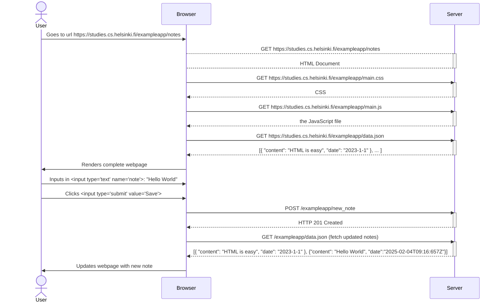

```mermaid
sequenceDiagram
    actor User
    participant Browser
    participant Server

User->>Browser: Goes to url https://studies.cs.helsinki.fi/exampleapp/notes
Browser-->Server: GET https://studies.cs.helsinki.fi/exampleapp/notes
activate Server
Server-->Browser: HTML Document
deactivate Server


Browser->>Server: GET https://studies.cs.helsinki.fi/exampleapp/main.css
activate Server
Server-->>Browser: CSS
deactivate Server


Browser->>Server: GET https://studies.cs.helsinki.fi/exampleapp/main.js
activate Server
Server-->>Browser: the JavaScript file
deactivate Server


Browser->>Server: GET https://studies.cs.helsinki.fi/exampleapp/data.json
activate Server
Server-->>Browser: [{ "content": "HTML is easy", "date": "2023-1-1" }, ... ]
deactivate Server

Browser->>User: Renders complete webpage

User->>Browser: Inputs in <input type="text" name="note">: "Hello World"
User->>Browser: Clicks <input type="submit" value="Save">

Browser->>Server: POST /exampleapp/new_note
activate Server
Server-->>Browser: HTTP 201 Created
deactivate Server

Browser->>Server: GET /exampleapp/data.json (fetch updated notes)
activate Server
Server-->>Browser: [{ "content": "HTML is easy", "date": "2023-1-1" }, {"content": "Hello World", "date":"2025-02-04T09:16:657Z"}]
deactivate Server

Browser->>User: Updates webpage with new note

```
