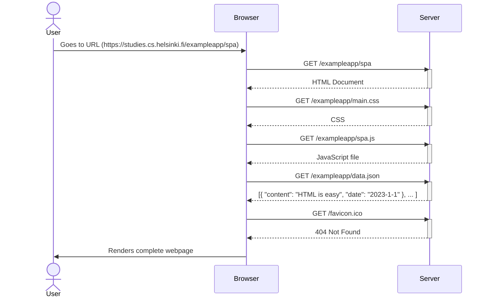

```mermaid
sequenceDiagram
    actor User
    participant Browser
    participant Server

    User->>Browser: Goes to URL (https://studies.cs.helsinki.fi/exampleapp/spa)
    Browser->>Server: GET /exampleapp/spa
    activate Server
    Server-->>Browser: HTML Document
    deactivate Server

    Browser->>Server: GET /exampleapp/main.css
    activate Server
    Server-->>Browser: CSS
    deactivate Server

    Browser->>Server: GET /exampleapp/spa.js
    activate Server
    Server-->>Browser: JavaScript file
    deactivate Server

    Browser->>Server: GET /exampleapp/data.json
    activate Server
    Server-->>Browser: [{ "content": "HTML is easy", "date": "2023-1-1" }, ... ]
    deactivate Server

    Browser->>Server: GET /favicon.ico
    activate Server
    Server-->>Browser: 404 Not Found
    deactivate Server


    Browser->>User: Renders complete webpage

```
